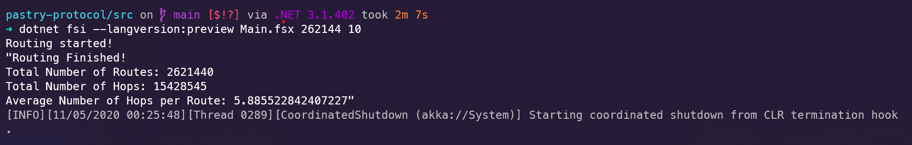

# Pastry-Protocol

The objective of this project is to implement Pastry protocol in F# using actor model provided by Akka.NET framework. 

# Team Members

* Shaishav Shah  
  UFID: 1136-3317
* Akib Maredia  
  UFID: 3885-6489

# What is working

* Implemented the Pastry API which works for joining and routing a network according to the pastry paper.
* The program takes in number of nodes and adds them to the network. The once the program starts, the number of nodes start requesting. 
* Every request is routed to the closest numerical value of the key that is to be requested eventually reaching the node with the desired key.
* Both the failure model and basic model are working.
* The average number of hops is printed at the end.

# Largest network

* The largest network that was managed was 262144
